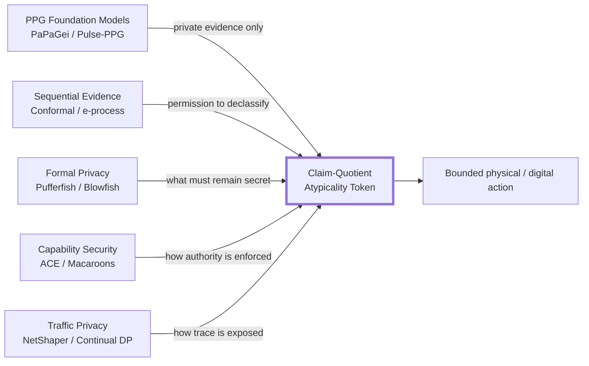
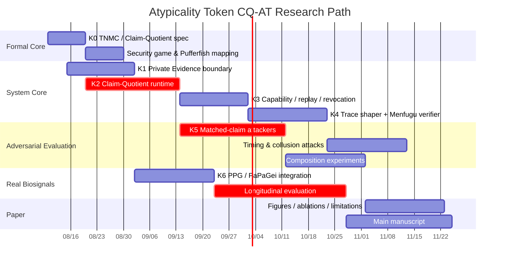
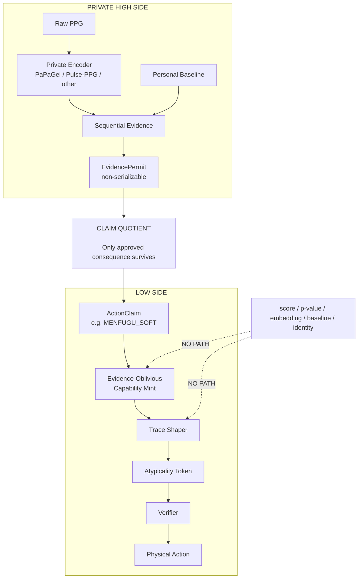
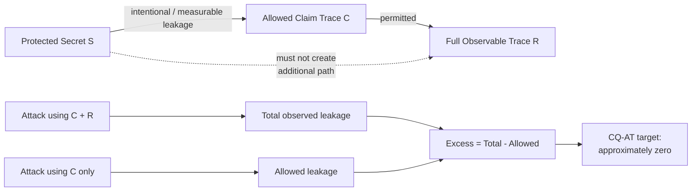

# Atypicality Token v2：単独で「世界初」を狙える研究的新規性の深掘り調査

## エグゼクティブサマリ

本調査の結論は明確です。**Atypicality Tokenの新規性を「PPGから匿名化tokenを作る」「鍵を変える」「短命tokenにする」「replayを防ぐ」「conformal anomaly detectionを使う」のいずれか単独に置くべきではありません。** PPG Foundation Model、逐次conformal/change detection、Pufferfish/Blowfish、IoT capability、revocation、traffic shapingは、それぞれ既にかなり成熟しています。PaPaGeiは57,000時間超・2,000万segmentでPPG表現を学習し、個人間のPPG morphology差を利用する設計を含みます。Pulse-PPGも実環境PPGのfoundation modelを提示しており、2026年のsensor-privacy研究は、binary eventのような粗いoutputですら時間連続性や補助情報と組み合わせると追加推論が可能だと実証しています。citeturn18search0turn18search2turn25search2turn20view0

**最も「世界初」の単独主張に向いている候補は、Atypicality Tokenを「変換された生体表現」ではなく、`Claim-Quotient Capability`として定義し、そのtoken内容だけでなく、発行時刻・packet size・silence・retransmission・反復releaseまで含む全observable traceについて、許可された低主張actionを条件としたnoninterferenceを保証することです。**

本報告ではこれを仮に、

> **Claim-Quotient Atypicality Token（CQ-AT）**  
> security property: **Trace Noninterference Modulo Claim（TNMC）**

と呼びます。

中心式は非常に単純です。

\[
C_{1:T}=\Phi_P(H_{1:T})
\]

\[
R_{1:T}=G_P(C_{1:T},U_{1:T})
\]

ここで \(H\) はprivateな生理学的history、\(C\) は明示的に許可されたaction/claim、\(R\) は攻撃者が観測可能な**全release trace**、\(U\) はprivate evidenceと独立なfresh randomnessです。

重要なのは、

\[
\boxed{
R_{1:T}\perp H_{1:T}\mid C_{1:T},P
}
\]

を設計不変条件にすることです。

すなわち、同じ許可済みclaim/action列を生じる二つの生体history \(H,H'\) について、

\[
\Phi_P(H)=\Phi_P(H')
\Rightarrow
\mathcal L(M(H))
=
\mathcal L(M(H'))
\]

を要求します。

これは、

> **「Atypicality Tokenがatypicalityを隠す」のではなく、Atypicality Token生成器そのものがatypicality evidenceを入力として受け取れない**

という設計です。

この方向は、2026年PoPETsの *Sensor Privacy as a Spectrum* が示した「raw dataをlocalにしてcoarse outputだけを出しても、observable interfaceとtemporal contextから漏れる」という問題に正面から答えます。同論文自身はinterface-conditioned leakageを**測る**枠組みを提示しており、固定されたchannelに対する新しいdefenseを提案することが主目的ではありません。したがって、**許可claimを唯一のdeclassification quotientとし、その後のtoken・transport・timingを全てそのquotientだけに依存させる防御機構**には、明確な研究空間があります。citeturn21view0turn22view0

さらにPufferfishはapplicationごとにsecret、secret pair、攻撃者のprior knowledgeを定義でき、Blowfishはpolicyで何を守り何を既知とするかを指定できます。一方、2026年のPufferfish composition研究は、**単発で漏れないPufferfish mechanismでも複数回実行すると全datasetが漏れる場合がある**ことを示し、合成にはDP型の追加条件が必要だと明らかにしました。したがって、Atypicality Tokenが長期間反復発行されることを正面から形式化するのは、時期的にも極めて重要です。citeturn23search0turn23search1turn19search1turn19search8

ただし、論文で無修飾の **“the world's first”** と書くことは勧めません。2026年8月9日までの一次資料を中心とした本調査では下記の完全一致方式を確認できませんでしたが、Scopus、Web of Science、全IEEE Xplore、全特許familyを網羅した法的prior-art searchではありません。学術的に適切な最強表現は、

> **“To the best of our knowledge, this is the first …”**

です。

**推奨する世界初主張の核はこれです。**

> **To the best of our knowledge, Atypicality Token is the first biosignal-derived action-capability primitive whose entire observable release trace is formally noninterfering with the underlying physiological evidence, modulo an explicitly declassified low-claim action sequence.**

日本語：

> **我々の知る限り、Atypicality Tokenは、明示的にdeclassifyされた低主張action列を除き、token内容・発行時刻・packet size・silence・反復releaseを含む観測trace全体を元の生理学的証拠から形式的に独立化する、初の生体信号由来action-capability primitiveである。**

この主張なら、**PaPaGeiでも、CAPEでも、Pufferfishでも、NetShaperでも、ACE-OAuthでも単独では取っていない交点**を狙えます。citeturn18search2turn20view0turn19search1turn17search2turn23search2


## 調査範囲と先行研究地図

本調査は2026年8月9日をcutoffとし、PPG/biosignal foundation models、wearable identity leakage、sensor-interface privacy、privacy-preserving sensor representation、sequential/conformal evidence、Pufferfish/Blowfish、continual-release privacy、traffic analysis、IoT capability authorization、revocation、zero-knowledge biometrics、adaptive baseline poisoningを横断しました。一次資料としてICLR Proceedings、PMLR、PoPETs、USENIX、ACM、RFC Editor、arXiv、および公式GitHubを優先しています。

一方、**CAPE-PPG-CED、MobiQuitousのClaim-Capped Biosignal Feedback、Minute-CAPE、現在のNoticer Core文書については、今回の公開Web検索では対応する公開一次資料を特定できませんでした。** したがって、この報告では本会話でユーザーが既存成果として定義してきた範囲、すなわち「within-person atypicality」「Claim Cap」「Privacy-Calibrated Encoder」「low-cardinality claim release」「ReleasePacket」「identity/reconstruction/membership/attribute/session-linkability評価」等を**既存の自成果として保守的にprior work扱い**します。DOI、arXiv ID、正式会議proceedingsは本調査上は**未指定**です。

公開研究側では、PaPaGeiはICLR 2025で発表されたopen PPG foundation modelで、57,000時間超・2,000万のunlabeled PPG segmentsを用い、20 tasks・10 datasetsを評価しています。公式repositoryはPPG morphologyの個人差を利用するrepresentation learningを明示しているため、PaPaGeiのembeddingを「privacy-preservingだから使う」のは逆で、**High Sideの高性能feature extractorまたは強いprivacy attack baselineとして使う**のが研究的には正しい位置づけです。citeturn18search0turn18search2

Pulse-PPGは100日間・120 participantsのfield PPGを用いたopen-source PPG foundation modelを提案し、lab/field双方のdownstream generalizationを狙っています。また2025年の *Know Me by My Pulse* はwrist-worn PPGをcontinuous authenticationに用いており、PPGが単なる心拍情報ではなく本人照合能力を持つことを改めて示す隣接研究です。つまり、「rawを出していない」「embeddingにした」というだけではidentity privacyを主張できません。citeturn25search2turn25search1

2026年の *Sensor Privacy as a Spectrum* はAtypicality Tokenに特に重要です。同研究は、raw sensor streamをlocalに置き、binary event、quantized embedding、coarse labelだけを外に出す設計でも、temporal continuity、multi-channel information、auxiliary contextがあればsensitive inferenceが成立し得ることを示しました。同論文では、quantized motion interfaceでも行動構造がかなり残り、temporal continuityを戻すことで推論性能が増加しています。したがって**「low-cardinalityだからprivacy」という論理は2026年時点では明確に弱い**です。citeturn20view0turn21view0

また、sequential evidence側にも既存技術があります。Conformal CUSUMは2025年にchange detectionについてvalidity/efficiencyを理論・実験の両面から扱っており、同じPMLR volumeにはconformal test martingalesやrecurrent concept driftへのconformal martingale応用もあります。2025年ICMLではonline differentially private conformal predictionまで登場しています。したがって、**「conformal p-value/e-processをAtypicality検出に使う」だけでは世界初の中心主張には不足**します。citeturn17search0turn17search3turn17search1

privacy側では、Pufferfishはsecretと攻撃者知識をapplication固有に定義でき、Blowfishはpolicyとして守るsecretと既知constraintsを表せます。さらに2025–2026年にはRényi/Sliced Rényi Pufferfishとprivacy accounting、Pufferfishのcomposition自体が急速に研究されています。したがって「Pufferfishを使いました」も新規性ではありません。**Atypicality Token固有のdeclassification semanticsをPufferfish secret-pairへ落とすこと**が新しい仕事になります。citeturn23search0turn23search1turn19search2turn19search1

authorization側も同様です。Macaroonsはauthorityを「誰が・どのcontextで使えるか」というcaveatで制限でき、ACE-OAuthはconstrained IoTでaccess tokenによるauthentication/authorizationを標準化しています。RFC 9201はproof-of-possession key binding、RFC 9203はOSCORE profile、RFC 9770は2025年にrevoked access tokenの通知方式を標準化しました。ゆえに、**service scope、TTL、nonce、replay protection、PoP、key rotation、revocation、署名**はAtypicality Tokenに必要ですが、それ自体をnoveltyにしてはいけません。citeturn23search3turn23search2turn23search6turn23search10turn19search3

timing protectionについても先行研究があります。USENIX Security 2024のNetShaperはpacket size/timing side channelに対してdifferentially private traffic shapingを提供し、privacy・bandwidth・latencyのtrade-offを設定できます。2026年にもDP under continual observationは活発で、edit-neighboring streamなど、出力列全体をprivacy対象とするより強いstream modelが研究されています。したがって、「一定間隔送信」「dummy packet」「timing DP」単独も世界初ではありません。citeturn17search2turn25search3turn25search7

このため、Atypicality Tokenが入るべき空白は次です。



**推論として、本調査で見つからなかったのは「生体証拠をaction capabilityへdeclassifyし、さらにそのcapabilityの全observable traceについて、許可claim以上の追加漏えいを形式的にゼロまたは有界にするprimitive」です。** この交点を狙うのが最も安全です。citeturn20view0turn19search1turn23search2turn17search2


## 技術比較と未充足ギャップ

下表では、CAPE/MobiQuitousについては**ユーザー提供の既存成果境界**として扱い、公開一次資料は「未指定」としています。それ以外は今回確認した公開一次資料に基づきます。

| 技術要素 | CAPE / MobiQuitous側の既存境界 | 2023–2026の公開研究での到達点 | Atypicality Tokenにまだ必要なもの |
|---|---|---|---|
| **token内容** | low-cardinality claim、ReleasePacket、continuous latent/exact scoreを外に出さない思想は既出扱い。公開一次資料：**未指定** | 2026 sensor-privacy研究はbinary/coarse outputsでもtemporal/contextual inferenceが残ることを示す。citeturn20view0turn21view0 | tokenを「低次元データ」にすらせず、**allowed actionのquotient object**として定義。token generatorからevidence型を排除する |
| **証拠モデル** | within-person atypicalityは既出扱い。公開一次資料：**未指定** | Conformal CUSUM、martingale、online conformal、online DP conformalが既に存在。citeturn17search0turn17search1turn17search3 | evidence理論自体をnoveltyにせず、**private evidence → declassification authority**の接続を新規化 |
| **baseline更新** | personal baseline localは既出扱い | biosignal test-time personalizationが研究され、2026年にはadaptive OOD detectorのself-poisoningとfrozen reserveによる防御も提示されている。citeturn24search14turn16search0 | baseline更新を**将来authorityを変えるsecurity-sensitive state mutation**として扱う |
| **trace privacy** | conditional-excess leakageの考えは既出扱い。ただしfull longitudinal traceの形式保証は未指定 | binary interfaceでもtemporal continuityで追加漏えいが生じることが実証済み。citeturn21view0 | **token + timing + size + silence + failures + repetitions**全体にclaim-conditioned guarantee |
| **cryptographic binding** | Atypicality Token構想にservice/epoch鍵を想定 | Macaroons、ACE-OAuth、PoP/OSCOREが既存。citeturn23search3turn23search2turn23search6turn23search10 | 標準部品として採用。**新規性には数えない** |
| **revocation** | 構想ありとしても独自性は弱い | RFC 9770がACE token revocation notificationを標準化。citeturn19search3 | Atypicality-specific policy失効の実装は必要だが、noveltyではない |
| **replay** | 新しい評価項目候補 | capability/access tokenでfreshness/PoP等は成熟した問題領域。citeturn23search2turn23search6 | end-to-end testは必要。ただし単独noveltyにしない |
| **timing shaping** | Minute-CAPEとの重複注意 | NetShaperはpacket size/timingへDP traffic shapingを提供。Continual-observation DPも発展中。citeturn17search2turn25search3 | generic shapingではなく、**allowed claim moduloで全trace dependencyを制御** |
| **active-attack耐性** | poisoning/flooding等はNoticer Core候補 | adaptive detector self-poisoningは2026年に理論化されている。citeturn16search0 | authority発行へのpoisoning、query adaptation、service collusionを統合評価 |
| **formal privacy定義** | empirical leakage中心として扱う | Pufferfish、Blowfish、RPP/SRPPなどが存在。citeturn23search0turn23search1turn19search2 | **「許可claimは漏れてよいが、それ以上は漏らさない」ことをbiosignal trace向けsecret-pairで形式化** |
| **composition / accounting** | longitudinal compositionは未指定 | 2026 Pufferfish compositionはsingle-run privacyが反復で崩壊し得ることを証明し、DP-style条件の必要性を示す。continual DPもstream全体を扱う。citeturn19search1turn25search3 | allowed claimそのものの累積漏えいと、**excess trace leakage**を分離してaccounting |
| **実機end-to-end** | Menfuguをreference actuatorとして予定 | ACEはconstrained IoT authorizationを標準化。ZK-SERIESはtemporal biometric privacy protocolを低性能smartphoneでも評価している。citeturn23search2turn16search1 | PPG private evidence → quotient → capability → BLE → physical actionまで同じprivacy invariantを維持 |

この比較から、**避けるべき新規性主張**はかなり明瞭です。

「PPG Foundation Modelを使う」はPaPaGei/Pulse-PPG側です。citeturn18search2turn25search2

「PPGから本人性を消す」はprivacy representation/cancelable biometric系と競合し、しかもCAPE側の既出領域です。

「online anomaly detectionをする」はconformal/change-detection側です。citeturn17search0turn17search3

「timingを隠す」はNetShaper/continual DP側です。citeturn17search2turn25search3

「replayできないtoken」はACE等のauthorization側です。citeturn23search2turn23search6

「ZKでbiometricを隠す」も、2025年のZK-SERIESがtemporal biometric comparisonをzero-knowledge化しています。citeturn16search1

したがって、新規性を一点に絞るなら、

> **“What is the only information dependency that is allowed to survive the high-to-low transition?”**

にします。

その答えを、

> **Only the explicitly authorized claim/action, not any representation of the evidence that justified it.**

とするのがAtypicality Tokenです。


## 新規メカニズム候補

以下の四案を比較すると、**候補Aが最も単独noveltyを取りやすく、候補BをAのformal extensionとして組み合わせる**のが最も強い構成です。

| 候補 | 技術概要 | 既存研究との差 | 実装難易度 | 主な攻撃面 | 必須評価 | 想定する主要図表 |
|---|---|---|---|---|---|---|
| **A. Claim-Quotient Atypicality Token（CQ-AT）** **推奨** | private evidenceを一度`ActionClaim`へquotient化し、その後token・scheduler・transportが**そのclaimとpublic policyしか入力に取れない**。full traceについてTNMCを保証 | CAPEの「低帯域claim release」を、**representation releaseからdeclassification quotient + action capability + full-trace noninterferenceへ昇格**。2026 Sensor Privacy研究はinterface leakageを測るが、この防御primitive自体は提示していない。citeturn20view0turn21view0 | 中〜高 | covert dependency、timing、logs、error paths、cross-service correlation | matched-claim indistinguishability、conditional attack advantage、taint/type check、timing attack、collusion、E2E | architecture、conditional attack bars、trace leakage plot、Menfugu E2E |
| **B. Composable Claim-Conditioned Trace Privacy Accountant** | allowed claimを条件にPufferfish/Blowfish secret pairsを定義し、approximate trace leakageへ\((\epsilon,\delta)\) budgetを割当。service/timeを跨ぐaccountant | Pufferfish一般理論やcompositionそのものは既存だが、**biosignal action releaseのallowed/excess leakageを二層でaccounting**する部分が差分。citeturn19search1turn19search2 | 高 | prior/model misspecification、privacy budget exhaustion、adaptive collusion | composition curve、epsilon vs delay/utility、multi-service attacks | privacy-budget trajectory、utility/privacy frontier |
| **C. Proof-Carrying Atypicality Token** | raw PPG/baseline/scoreを見せず「policy predicateを満たした」ことをZK proofとしてcapabilityへ付与 | ZK temporal biometric自体はZK-SERIESが既存。差はidentity-matchではなく**within-person change-policy satisfaction proof**。citeturn16search1 | 非常に高 | malicious sensor、false witness、circuit bugs、baseline commitment freshness | proof completeness/soundness、proof time/size、phone/MCU verification、poisoning | circuit diagram、proof latency/size graph |
| **D. Authority-Safe Baseline Evolution** | Anchor/Shadow baselineを分離し、baseline updateを「future action authorityを変更する操作」として扱う。promotionに安全条件・epoch transitionを要求 | adaptive baseline poisoning自体は新しくなく、2026年にはself-poisoning理論とfrozen reserve defenseがある。新規点は**no-privilege-amplificationとしてbaseline updateを扱うこと**。citeturn16search0 | 高 | slow-boil poisoning、context drift、sensor spoofing | contamination sweeps、authority drift、false issue/suppression、recovery | poisoning phase diagram、authority drift curve |

**候補Aの新規性確度が最も高い理由**は、その主張が個々のcomponentの新規性に依存しないからです。

PaPaGeiを別encoderへ交換しても成立します。Conformal CUSUMを別change detectorへ交換しても成立します。Ed25519をCOSE/ACEへ交換しても成立します。Menfuguを別actuatorへ交換しても成立します。citeturn18search2turn17search0turn23search2

つまり、研究貢献はalgorithm choiceではなく、

\[
\boxed{
\text{Private evidence}
\rightarrow
\text{explicit declassification quotient}
\rightarrow
\text{evidence-oblivious action capability}
}
\]

という**新しいinformation boundary**にあります。

候補Bも強力ですが、2026年のPufferfish composition論文が非常に近い時期に出ており、composition/accountingそのものを世界初と主張する余地はありません。本研究ではその理論を利用して「Atypicality Tokenにおけるallowed leakageとexcess leakageをどう分離するか」に限定すべきです。citeturn19search1turn19search8

候補Cは見栄えは最もdeep-techですが、**「ZKだから新しい」という論文は危険**です。ZK-SERIESは既にtemporal biometric comparisonをprivacy-preservingに実施しています。さらに、Noticer Core自体がtrusted issuerなら、verifierにZK proofを見せる必要性を査読者から問われます。第三者verifierがNoticer Coreを信用しない明確なthreat modelが出てからstretch contributionとして追加すべきです。citeturn16search1

候補Dは重要ですが、2026年7月のself-poisoning研究がadaptive OOD detectorのfeedback contaminationを理論化し、frozen reserveによるadmission gateまで提案しています。このため「Anchor/Shadowを分ける」程度では世界初になりません。**baseline updateをauthority amplificationとして形式化するところまで進めれば別論文級**です。citeturn16search0


## 推奨案：Claim-Quotient Atypicality Token

推奨する単独の中心貢献は、**Claim-Quotient Atypicality Token（CQ-AT）**です。

これは「Atypicalityをtoken化する」方式ではありません。

現在の典型的な発想は、

\[
x_t
\rightarrow E(x_t)
\rightarrow T_k(E(x_t),B_u)
\rightarrow z_t
\]

です。

この形では \(z_t\) がどれほど変換されていても、\(E(x_t)\) や \(B_u\) の統計的構造が残る余地があります。PPG foundation modelsが豊かなmorphological representationを取得できること、またcoarse outputでもtemporal contextからprivate inferenceが可能なことを考えると、「変換後representationを外に出す」という発想そのものを捨てる方が安全です。citeturn18search0turn20view0

CQ-ATでは次のようにします。

\[
H_{1:t}
\xrightarrow{\text{private evidence}}
E_t
\xrightarrow{\Phi_P}
C_t
\xrightarrow{\text{hard boundary}}
\operatorname{Mint}(C_t,P,V,U_t)
\rightarrow AT_t
\]

ここで、

- \(H_{1:t}\)：raw PPG、embedding、baseline、score、p-value、e-value等を含むprivate history
- \(E_t\)：private evidence / EvidencePermit
- \(\Phi_P\)：policy-controlled declassifier
- \(C_t\)：許可された有限alphabetのaction claim
- \(V\)：対象verifier
- \(U_t\)：fresh randomness
- \(AT_t\)：Atypicality Token

です。

**最重要設計制約**は、

> `Mint()` が `EvidencePermit`、embedding、score、baselineを引数として受け取れない

ことです。

つまり、

```text
Forbidden

Mint(
    evidence_score,
    p_value,
    embedding,
    baseline_distance,
    action
)
```

ではなく、

```text
Allowed

consume(EvidencePermit)
        ↓
ClaimQuotient
        ↓
ActionClaim::MenfuguInflateSoft
        ↓
Mint(
    ActionClaim,
    PublicPolicy,
    AudienceBinding,
    FreshRandomness
)
```

にします。

`ClaimQuotient`通過後は、**生理学的情報が再びLow Sideへ流れ込むAPI経路そのものを存在させません。**

この考え方のポイントは、Atypicality Tokenを、

> **compressed physiological object**

ではなく、

> **cryptographically protected consequence of an approved declassification**

として扱うことです。

MacaroonsやACE-OAuthは後半の「authorityをどう守るか」について非常に良い既存primitiveを提供しますが、前半の「private physiological evidenceのうち何をauthorityへ変えてよいか」は定義しません。そこがCQ-AT固有です。citeturn23search3turn23search2

そしてtoken bytesだけを守っても不十分なので、Low Sideのobservableを、

\[
R_{1:T}
=
(
\text{token bodies},
\text{packet times},
\text{packet sizes},
\text{silence},
\text{retries},
\text{errors},
\text{key changes},
\text{actions}
)_{1:T}
\]

とします。

2026年のSensor Privacy研究が、binary interfacesでもtemporal continuityを利用すると推論能力が高まることを示しているため、この拡張は単なる「念のため」ではなく、現在の先行研究が直接要求している問題設定です。citeturn21view0turn22view0

CQ-ATではrelease subsystem全体について、

\[
R_{1:T}=G_P(C_{1:T},U_{1:T},W_{1:T})
\]

とします。

\(W\) はpublic clockやpublic network stateなどです。ただし、\(W\) が実はユーザー行動からprivate informationを受け取っている場合はTNMCの仮定が崩れるため、固定slottingやtraffic shaping等で切断する必要があります。generic timing defenseにはNetShaper等の先行研究があるので、そこは既存技術を利用してよい領域です。citeturn17search2

**論文での主張文は次を推奨します。**

英語：

> **To the best of our knowledge, we introduce the first biosignal-derived action-capability primitive that enforces full-release-trace noninterference modulo an explicitly declassified low-claim action: once private physiological evidence is reduced to an authorized claim, token contents, timing, metadata, and repeated releases are prohibited from depending on the underlying evidence.**

短縮版：

> **Atypicality Token is generated from atypicality, but contains no representation of atypicality.**

日本語：

> **我々の知る限り、本研究は、明示的にdeclassifyされた低主張actionを除いて、token内容・timing・metadata・反復releaseを元の生理学的証拠へ依存させないfull-release-trace noninterferenceを実現する、初の生体信号由来action-capability primitiveを提案する。**

短縮版：

> **Atypicality Tokenは非典型性を表すtokenではない。非典型性の証拠を根拠として発行されるが、その証拠を一切表現しないtokenである。**

この表現なら、「CAPE-PPG-CEDとの差」も一文で説明できます。

> **CAPE-PPG-CED asks what bounded information may cross the boundary; CQ-AT asks whether anything other than the explicitly declassified consequence can influence the entire observable release trace.**

この差は重要です。**low-cardinality claimを出すこと**から、**low-side system全体をclaimのquotientとして構成すること**へ進んでいます。


## 形式的定義・実験・実装計画

まずPrivate Historyを、

\[
H_{1:T}
=
(X_{1:T},Z_{1:T},B_{1:T},Q_{1:T},E_{1:T},K)
\]

とします。

ここで \(X\) はraw biosignal、\(Z\) はprivate representation、\(B\) はpersonal baseline、\(Q\) はsignal quality、\(E\) はstatistical evidence、\(K\) はprivate context/stateです。

Policy \(P\) による許可済みdeclassifierを、

\[
\Phi_P:\mathcal H\rightarrow\mathcal C
\]

と定義し、

\[
C_{1:T}=\Phi_P(H_{1:T})
\]

とします。

\(\mathcal C\) は例えば、

\[
\{
\texttt{NO\_ACTION},
\texttt{MENFUGU\_SOFT},
\texttt{AMBIENT\_PULSE},
\texttt{REVIEW\_PROMPT}
\}
\]

だけです。

### 厳密モード：Trace Noninterference Modulo Claim

**提案定義。**

Release mechanism \(M_P\) がTNMCを満たすとは、任意の二つのprivate histories \(h,h'\) に対し、

\[
\Phi_P(h)=\Phi_P(h')
\]

ならば、

\[
\boxed{
\mathcal L(M_P(h))
=
\mathcal L(M_P(h'))
}
\]

であることとします。

同値に、

\[
M_P(H)
=
G_P(\Phi_P(H),U)
\]

かつ、

\[
U\perp H
\]

であれば、

\[
M_P(H)\perp H\mid \Phi_P(H)
\]

です。

直観的には、

> **許可されたactionが同じなら、攻撃者が観測するtoken/trace分布も同じでなければならない。**

これは「誰のPPGだったか」「scoreが0.71か0.99か」「PaPaGei embeddingがどうだったか」「baselineから何sigma離れたか」がrelease traceへ影響することを禁止します。

重要なのは、**このpropertyはAtypicality detectorの種類から独立**していることです。PaPaGei、Pulse-PPG、手設計HRV、conformal CUSUMのどれをHigh Sideで使っても、declassifier後のsecurity invariantは同じです。PaPaGeiやConformal CUSUMは既存研究なので、この分離はnoveltyを既存algorithmに依存させないという意味でも有利です。citeturn18search2turn25search2turn17search0

### 計算量的security game

cryptographic implementationでは完全なdistribution equalityの代わりに、攻撃者 \(\mathcal A\) に二つのhistoryを選ばせます。

\[
h_0,h_1:
\quad
\Phi_P(h_0)=\Phi_P(h_1)
\]

challengerは、

\[
b\leftarrow\{0,1\}
\]

を選び、

\[
R\leftarrow M_P(h_b)
\]

を渡します。

攻撃者のadvantageを、

\[
\operatorname{Adv}^{TNMC}_{\mathcal A}
=
\left|
\Pr[\mathcal A(R)=b]-\frac12
\right|
\]

とします。

目標は、

\[
\operatorname{Adv}^{TNMC}_{\mathcal A}
\le
\operatorname{negl}(\lambda)
\]

です。

これは**identityを一切推定できない**という意味ではありません。許可されたclaim \(C\) 自体がidentityと相関する場合、その情報は既に意図的にdeclassifyされています。

そこで論文では、必ず、

\[
\underbrace{\text{Leakage from }C}_{\text{explicitly allowed}}
\]

と、

\[
\underbrace{\text{Leakage from }R\mid C}_{\text{forbidden excess}}
\]

を分けます。

この区別こそ、Atypicality Token論文の最も重要な概念図になります。

### Pufferfishによる近似目標

厳密TNMCが難しいdeployment modeでは、Pufferfishとして近似定義できます。Pufferfishはapplication-specificなsecretとadversarial priorを定義できるため、この用途に自然です。citeturn23search0

secret setを例えば、

\[
\mathcal S=
\{
S_{\mathrm{id}},
S_{\mathrm{age}},
S_{\mathrm{sex}},
S_{\mathrm{morph}},
S_{\mathrm{stress}},
S_{\mathrm{waveform}}
\}
\]

とします。

許可claim \(c\) ごとにsecret-pair setを、

\[
\mathcal Q_c
=
\{
(s_i,s_j):
s_i\neq s_j,
\Pr_\theta[S=s_i,C=c]>0,
\Pr_\theta[S=s_j,C=c]>0
\}
\]

と定義します。

Atypicality Token release mechanism \(M\) が、claim-conditioned \((\epsilon,\delta)\)-Pufferfish privacyを満たすとは、

\[
\Pr_\theta[
M(H)\in O
\mid
S=s_i,C=c
]
\le
e^\epsilon
\Pr_\theta[
M(H)\in O
\mid
S=s_j,C=c
]
+\delta
\]

が全ての

\[
\theta\in\Theta,\quad
(s_i,s_j)\in\mathcal Q_c,\quad
O
\]

について成立することとします。

これは新しいPufferfish一般理論を主張するものではありません。**「allowed claim以上の追加漏えい」というNoticer固有のsecret-pair instantiation**です。PufferfishとBlowfishがcustom secret/policyを既に扱うことは明示して引用すべきです。citeturn23search0turn23search1

そしてcompositionについては、勝手に「Pufferfishだから足せる」と書いてはいけません。2026年のBaiらは、Pufferfish mechanismは単独ではno leakageでも反復実行でdataset全体を漏らし得る例が存在し、linear compositionにはDP型条件が必要であることを示しています。approximate modeではこの結果に従い、DP-style constraintまたは対応するinfluence-curve条件を満たすrelease shaperだけをcomposable modeとして扱うべきです。citeturn19search1turn19search8

一方、**strict CQ factorization**、

\[
R_{1:T}=G(C_{1:T},U_{1:T})
\]

を完全に実装できれば、任意の\(T\)について、

\[
R_{1:T}\perp H_{1:T}\mid C_{1:T}
\]

がそのまま成立します。

ここで「composition costがゼロ」という表現を使うなら、

> **zero additional/excess leakage beyond the complete allowed claim trace**

と限定してください。

**allowed claim traceそのものの漏えいがゼロになるわけではありません。**

これを混同すると査読で確実に突かれます。

実験は次のように設計するのが最も強いです。

| 実験 | 目的 | 攻撃者 | 指標 | 暫定成功基準 |
|---|---|---|---|---|
| **Matched-Claim Trace Game** | 同じclaimを出した異なるprivate historiesをrelease traceから区別できるか | Transformer/RF/XGBoost/sequence attacker | TNMC distinguishing advantage、ROC-AUC | AUCの95% CIが0.55未満、またはadvantage上限を事前登録 |
| **Conditional Identity Attack** | claim以上にidentityが漏れるか | adaptive identity classifier | \(AUC(R,C)-AUC(C)\)、Macro-F1 advantage | excess advantageの95% CI上限 ≤ 0.02を候補基準 |
| **Attribute / Semantic Attack** | age/sex/stress等の追加推論 | adaptive classifiers | conditional AUC/AUPRC | claim-onlyとの差が事前閾値以下 |
| **Conditional Mutual Information** | model-specific attack以外のleakage | estimator ensemble | \(I(S;R\mid C)\) | estimator uncertainty込みでsmall/near-zero |
| **Timing-Only Attack** | timestamps/silenceだけの漏えい | sequence classifier | AUC、Bayes vulnerability | claim-only baselineから有意改善しない |
| **Cross-Service Collusion** | service A/Bのtrace照合 | pairwise verifier | linkability AUC/EER | traceによるexcess linkabilityを事前閾値以下 |
| **Token Mutation / Replay** | authority integrity | active attacker | unauthorized accept | 大規模negative suiteでobserved acceptance 0 |
| **Claim Bypass** | EvidencePermitからscore等がLow Sideへ出ないか | static/dynamic taint | prohibited flows | 0 prohibited flow |
| **Physical E2E** | privacyを守ってutilityが残るか | Menfugu | action fidelity、delay、energy | unprotected referenceに対しaction fidelity ≥95%を候補目標 |
| **Longitudinal Composition** | 長期使用でexcess leakageが増えるか | adaptive recurrent attacker | excess attack advantage vs T | strict modeではT増加に伴うexcess trendなし |

上記の0.02、0.55、95%等は既存文献の普遍的security standardではなく、**論文前にpre-registerする候補engineering criterion**です。正式値はpilot studyでvarianceを確認したうえで固定すべきです。

特に2026年のSensor Privacy研究がAccuracy/Macro-F1だけでなくMI/NMIやBayes vulnerabilityも併用しているため、Atypicality Tokenも一つのclassifierだけでprivacyを判断しない方が強いです。citeturn21view0

K0–K6への配置は次です。

| Phase | CQ-ATで実装するもの |
|---|---|
| **K0** | `ClaimQuotient`、TNMC、Pufferfish secret pairs、allowed/excess leakageの形式仕様 |
| **K1** | private evidence engine。PaPaGei/Conformal等は交換可能。`EvidencePermit`はnon-serializable |
| **K2** | **研究核心**。`EvidencePermit → ActionClaim`のone-way quotient、Low Side type boundary、matched-claim trace simulator、TNMC game |
| **K3** | ACE/COSE等を参考にしたstandard cryptographic capability envelope、PoP、epoch、replay、revocation |
| **K4** | fixed/bounded release scheduler、BLE trace shaping、Menfugu verifier |
| **K5** | identity/attribute/semantic/timing/collusion/replay攻撃を統合したAttack Observatory |
| **K6** | real PPG、PaPaGei/Pulse-PPG等High Side model、longitudinal E2E evaluation |

つまり、**今いちばん実装すべきなのはK2です。** K1のanomaly detectorを極端に高度化するより先に、「private evidenceがquotientを越えた後に絶対戻れない」依存構造を作る方が、論文のnew primitiveを実体化できます。

研究timelineは例えば次です。



必要な追加data/resourceとして最重要なのは、**multi-session / multi-day PPG**です。PaPaGeiの公式weights/codeは利用可能で、Pulse-PPGもfield PPG foundation modelとして有力な比較対象です。citeturn18search0turn25search2

ただし、cross-session・cross-service linkabilityを強く評価するには、同一人物の複数日・複数sessionが確実に存在するwrist PPG cohortが必要です。本調査ではNoticer Core向けに最適な公開datasetを一つに確定していないため、この部分は**未指定**です。既存のWESAD/CASE等を補助的に用いつつ、必要ならIRB/倫理審査下で20–40名程度のmulti-day collectionを追加することが論文強度を大きく上げます。

また、現実のデータだけでは「同じ許可claimだがprivate evidenceだけが異なる」counterfactual pairを大量に作りにくいため、**matched-claim synthetic trace generator**も必須です。これはprivacyの有利なsynthetic resultを作るためではなく、TNMCのsecurity gameを実装レベルで検証するために使います。


## リスク・限界と反証条件

最大の理論的リスクは、**TNMCが「許可claimを条件にしてしまえば当たり前ではないか」と査読者に見えること**です。

この反論には正面から答える必要があります。

確かに、noninterference modulo declassificationという一般的思想自体を本研究が発明したと主張してはいけません。Pufferfish/Blowfishもapplication-specific secretを扱い、information-flow/security研究にはdeclassificationの長い蓄積があります。したがって世界初主張は、

> 「conditional privacyを発明した」

ではなく、

> **「生体信号由来の逐次private evidenceを、explicit claim quotientを唯一の出口としてaction capabilityへ変換し、そのtokenだけでなくfull longitudinal traceまでmodulo-claim noninterferenceの対象にしたprimitiveとend-to-end implementation」**

に限定する必要があります。PufferfishやBlowfishはprivacy semanticsを与えますが、biosignal evidence → physical action capabilityというarchitectureは定義しません。ACE/Macaroonsはauthority semanticsを与えますが、sensor declassification privacyは定義しません。Sensor Privacy as a Spectrumはinterface leakageを測りますが、防御primitiveそのものを中心貢献とはしていません。citeturn23search0turn23search1turn23search2turn23search3turn21view0

二つ目の重大な限界は、**allowed claim自体が漏らす情報**です。

例えば、AさんのMenfuguが毎日9:05だけ膨らむなら、token bytesが完全にevidence-obliviousでも、

```text
毎朝9:05にaction
```

というclaim trace自体がroutineや職場状況を推定させる可能性があります。

TNMCが保証するのは、

> actionを公開した以上にtoken implementationが追加で何を漏らすか

であり、

> actionを公開すること自体がprivacy-safe

ではありません。

このため論文では最低限、

\[
L_{\text{allowed}}
=
\operatorname{Leakage}(S;C)
\]

と、

\[
L_{\text{excess}}
=
\operatorname{Leakage}(S;R\mid C)
\]

を**別々に報告する**必要があります。

2026年のSensor Privacy研究が、coarse interfacesでもtemporal continuityによるinferenceを示したことは、この区別が実際に必要であることを補強します。citeturn20view0turn21view0

三つ目はbaselineです。adaptive baselineを自動更新すると、攻撃者や長期driftが「usual」の定義そのものを変え、最終的にはActionClaim発行を操作できます。2026年のadaptive OOD研究でもself-poisoningのfeedback loopが理論・実験の両方から問題になっています。したがってAnchor/Shadow分離は必要ですが、それをCQ-ATの世界初主張と混ぜず、**security prerequisiteまたは第二貢献**として扱うべきです。citeturn16search0

現実的な攻撃者としては、malicious application、正規accessを持つcurious service、colluding services、BLE/network observer、adaptive ML attacker、replay/forgery attacker、baseline poisoning attacker、device-side malware、bystander observerを区別する必要があります。ただしOS/kernel/TEEまで完全に侵害された攻撃者にTNMCを保証するなら、別途remote attestationやtrusted hardwareが必要になります。v1論文では「Noticer Core processとkey storeは信頼する」と明記する方が安全です。

**反証条件**はかなり厳しく設定できます。

| 反証 | 意味 |
|---|---|
| Low Side componentがscore、p-value、embedding、baselineを直接参照できる | CQ-AT architecture自体が成立していない |
| 同じActionClaimを持つtraceから、hidden evidence magnitudeを有意に分類できる | TNMC implementation failure |
| claim-only attackerよりfull-trace attackerが安定して強い | excess leakageが存在 |
| timing-only attackerがidentity/conditionを追加推定できる | schedulerがevidence-obliviousでない |
| service A/Bのpairwise identifiersを変えてもtrace timingで容易に照合できる | cross-service trace separation不足 |
| 長期Tでexcess attack advantageが増え続ける | strict composition claimを撤回 |
| utility維持のためexact score/confidenceを外へ出す必要がある | Claim-Quotient abstractionが実用上破綻 |
| reviewerが同一security primitiveを既発表研究で示す | “first” claimを撤回または狭める |

法的・倫理的には、Atypicality Tokenがstress、depression、productivity、diagnosis等を推定・伝達する設計へ戻ると、NoticerのClaim Cap思想自体が崩れます。特に職場でのmanager-facing monitoringや本人同意を越えた二次利用は、技術的privacyが成立していても倫理的妥当性を保証しません。論文では「privacy-preservingだから利用目的も正当」という推論を明示的に拒否すべきです。

特許面では注意が必要です。限定的なGoogle Patents調査でも、physiological signalによるbiometric authenticationや、認証結果をtoken/proximity tokenとして扱う既存特許が確認できます。したがって「生体情報からtokenを作る」「wearable biometric token」という広いclaimは既存patent landscapeと衝突しやすいです。citeturn16search2turn16search8

一方、今回の限定検索では**「explicit claim quotientを唯一のdeclassification boundaryとし、biosignal-derived action capabilityのfull observable traceについてmodulo-claim noninterferenceを保証する」**という完全一致claimは確認できませんでした。ただし、これはFreedom-to-Operate調査でもpatentability opinionでもありません。論文の「世界初」と特許法上の「新規性・進歩性」は別物です。出願を考える場合は公開前に専門家によるclaim-level patent searchが必要です。


## 論文用アウトプットと主要参照

論文のcontributionは、最終的には**四本ではなく三本程度に絞る**のがよいです。

**日本語版**

- **Claim-Quotient Atypicality Token.** 本人内変化のprivate evidenceを外部representationへ変換するのではなく、明示的に許可されたaction claimへ不可逆にquotient化し、そのclaimだけから短命action capabilityを生成する新しいbiosignal declassification primitiveを提案する。
- **Full-Trace Noninterference Modulo Claim.** token payloadだけでなく、timing、size、silence、retry、反復releaseを含むobservable trace全体について、allowed claimを条件としたprivate physiological evidenceからの独立性を形式化し、strictおよびapproximate/Pufferfish型のsecurity goalを与える。
- **End-to-End Adversarial Validation.** identity、attribute、semantic、timing、cross-service collusion、replay、forgery、poisoningを含むadaptive attack下で、allowed-claim leakageとforbidden excess leakageを分離して測定し、wearable → Noticer Core → BLE → token-verifying actuatorまで検証する。

**English version**

- **Claim-Quotient Atypicality Tokens.** We introduce a biosignal declassification primitive that irreversibly reduces private evidence of within-person change to an explicitly authorized action claim, from which a short-lived action capability is minted without exposing any physiological representation.
- **Full-Trace Noninterference Modulo Claim.** We formalize privacy over the complete observable release trace—including token contents, timing, size, silence, retries, and repeated releases—requiring that it reveal no information about the underlying physiological evidence beyond the explicitly declassified claim.
- **End-to-End Adversarial Validation.** We separate allowed-claim leakage from forbidden excess leakage and evaluate adaptive identity, attribute, semantic, timing, cross-service, replay, forgery, and poisoning attacks across an end-to-end wearable-to-actuator implementation.

論文の中心図はこれで十分強いです。



論文で最も説得力のある結果図は、単なる「identity AUCが下がった」図ではなく、次の三曲線を同じ横軸 \(T\) に置くものです。

\[
\text{Claim-only attacker}
\]

\[
\text{Full-trace attacker}
\]

\[
\Delta_{\text{excess}}
=
\text{Full trace}-\text{Claim only}
\]

理想結果は、時間が長くなれば**Claim-only leakageは増える可能性があるが、Full-traceとの差だけはゼロ近傍に留まる**というものです。



**主要参照リスト**は以下です。CAPE-PPG-CED/MobiQuitousは今回公開一次資料を確認できていないため別枠です。

| 研究 | 書誌情報 | 本研究との関係 |
|---|---|---|
| **PaPaGei** | Pillai et al., *PaPaGei: Open Foundation Models for Optical Physiological Signals*, **ICLR 2025**, arXiv:`2410.20542`; DOI **未指定**。公式GitHubあり。citeturn18search0turn18search2 | 強力なHigh-Side PPG encoder。privacy mechanismではない |
| **Pulse-PPG** | Saha et al., *Pulse-PPG: An Open-Source Field-Trained PPG Foundation Model…*, arXiv:`2502.01108`; 本調査で一次資料上のDOI **未指定**。citeturn25search2 | real-world PPG representation baseline |
| **Know Me by My Pulse** | Shao et al., *Toward Practical Continuous Authentication…*, arXiv:`2508.13690`; 本調査一次資料でvenue/DOI **未指定**。citeturn25search1 | PPGに本人照合能力が残ることのsecurity-side evidence |
| **Sensor Privacy as a Spectrum** | Paul et al., **PoPETs 2026(4), 341–357**, DOI:`10.56553/popets-2026-0124`。citeturn19search0turn21view0 | coarse sensor interface + temporal contextのleakage。CQ-ATの最重要直接隣接研究 |
| **PrivDiffuser** | Yang & Ardakanian, *Privacy-Guided Diffusion Model for Data Obfuscation in Sensor Networks*, **PoPETs 2025**, DOI:`10.56553/popets-2025-0118`。citeturn25search0turn25search4 | 「共有dataをprivatizeする」系。CQ-ATはdata共有自体をaction authorityへ置換 |
| **Conformal CUSUM** | Vovk, Nouretdinov, Gammerman, **PMLR 266, 2025**, pp.576–594; DOI **未指定**。citeturn17search0 | private sequential evidenceの候補。ここ自体はnoveltyではない |
| **Online Differentially Private Conformal Prediction** | Zhang et al., **ICML 2025 / PMLR 267**; DOI **未指定**。citeturn17search1 | online conformal + privacyの組合せが既にあることを示す |
| **Pufferfish** | Kifer & Machanavajjhala, *ACM TODS* 39(1), DOI:`10.1145/2514689`。citeturn23search0 | claim-conditioned secret definitionの基礎 |
| **Blowfish** | He, Machanavajjhala, Ding, **SIGMOD 2014**, DOI:`10.1145/2588555.2588581`。citeturn23search1turn23search9 | policy-defined secret/constraintの基礎 |
| **Composition for Pufferfish Privacy** | Bai et al., arXiv:`2602.02718`, 2026; 本調査一次資料上の正式venue **未指定**。citeturn19search1turn19search8 | repeated Atypicality Tokenに直結。一般Pufferfishが自動compositionしない |
| **Sliced Rényi Pufferfish Privacy** | Zhang & Vorobeychik, arXiv:`2512.01115`, 2025; venue **未指定**。citeturn19search2 | Pufferfish-family privacy accountingの最新隣接研究 |
| **NetShaper** | Sabzi et al., **USENIX Security 2024**; DOI **未指定**。citeturn17search2 | timing/size DP shaping。generic traffic privacyなのでCQ-ATのtiming機構はこれをprior work扱い |
| **ACE-OAuth** | IETF **RFC 9200**, 2022。citeturn23search2 | constrained-device capability/access controlの標準基盤 |
| **ACE PoP / OSCORE** | IETF **RFC 9201 / RFC 9203**, 2022。citeturn23search6turn23search10 | proof-of-possession等。独自暗号を作る必要を減らす |
| **ACE Token Revocation** | IETF **RFC 9770**, 2025。citeturn19search3 | revocationをnoveltyにしてはいけない根拠 |
| **Macaroons** | Birgisson et al., **NDSS 2014**; DOI **未指定**。citeturn23search3 | contextual capability restrictionの代表的先行研究 |
| **ZK-SERIES** | Reijsbergen et al., arXiv:`2506.19393`, 2025; venue **未指定**。citeturn16search1 | temporal biometric + ZKの直接隣接研究 |
| **Self-Poisoning in Adaptive OOD Detection** | Balachandran, arXiv:`2607.21673`, 2026; venue **未指定**。citeturn16search0 | adaptive baseline / poisoning defenseの最新競合 |

最終的な研究境界は、次の一文に固定するのが最も強いです。

> **PaPaGei learns physiological representations. Conformal methods decide whether evidence is unusual. Pufferfish defines what must remain secret. ACE secures authority. NetShaper hides traffic structure. Atypicality Token's new contribution is the boundary that makes the explicitly authorized consequence the only information dependency permitted to survive across all of them.** citeturn18search2turn17search0turn23search0turn23search2turn17search2

日本語では、

> **PaPaGeiは生理表現を学習する。Conformal法は変化の証拠を判定する。Pufferfishは何を秘密にするかを定義する。ACEは権限を守る。NetShaperはtraffic structureを隠す。Atypicality Tokenの新規性は、その全ての間に「許可された結果だけが境界を生き残れる」という唯一のdeclassification boundaryを作ることにある。** citeturn18search2turn17search0turn23search0turn23search2turn17search2

この境界を**型で強制し、full traceで証明し、adaptive attackerで壊しに行き、Menfuguの物理作用まで通す**ところまで完成すれば、「PPGのprivacy-aware tokenを作りました」ではなく、**新しいbiosignal security primitiveを作った**という論文構成になります。