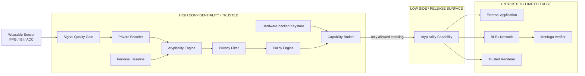
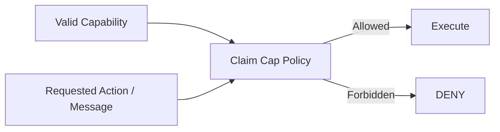

# Noticer Core System Boundary v0.1

> **生体情報そのものではなく、許可された行為だけを境界の外へ出す。**

Status: Working Specification  
Last Updated: 2026-08-09

---

## 1. Purpose

Noticer Coreにおける、

- 何が秘密領域に存在するか
- 何が境界を越えてよいか
- 誰が境界を越えさせられるか
- 外部主体が何を直接取得できないか

を実装可能な形で固定する。

---

# 2. Core Principle

Noticer Coreでは、

```text
biosignal
    ↓
interpretation
    ↓
public data
```

という一般的なセンシングAPIを採用しない。

代わりに、

```text
biosignal
    ↓
private computation
    ↓
bounded authority
    ↓
authorized action
```

とする。

外部アプリケーションは、

> 「ユーザーの状態は何か？」

を問い合わせるのではなく、

> 「この限定されたactionを実行する権限が存在するか？」

だけを扱う。

---

# 3. Boundary Overview



---

# 4. High-Confidentiality Objects

以下の情報は原則としてNoticer Coreの信頼境界内に留める。

## Raw Signals

* raw PPG
* raw IBI
* raw ACC
* raw sensor timestamps
* detailed signal-quality traces

## Internal Representations

* physiological feature vectors
* HRV features
* private pulse representations
* continuous embeddings
* encoder intermediate activations

## Personal State

* personal baseline
* baseline history
* baseline update statistics
* exact atypicality score
* confidence score

## Sensitive Metadata

* exact event timestamp
* sensor/device fingerprint
* model-internal identifiers
* user identity
* demographic / physiological attributes

## Secret Material

* service keys
* epoch keys
* device keys
* revocation state
* capability signing/authentication keys

---

# 5. Boundary Crossing Rule

High SideからLow Sideへ情報を移動できる唯一のコンポーネントは、

```text
Capability Broker
```

とする。

他コンポーネントから直接外部へ出力してはならない。

禁止例：

```text
Encoder ---------> App       ❌
Baseline --------> Cloud     ❌
Atypicality Score -> BLE     ❌
PPG -------------> Menfugu   ❌
```

許可される経路：

```text
Private State
    ↓
Policy Engine
    ↓
Capability Broker
    ↓
Atypicality Capability
    ↓
Authorized Consumer
```

---

# 6. Atypicality Capability

外部へ渡すobjectは、
「状態データ」ではなく「限定された権限」である。

Conceptual representation:

```text
AtypicalityCapability {
    protocol_version
    service_domain
    device_domain
    epoch
    authorized_action
    policy_id
    coarse_time
    expires_at
    sequence
    nonce
    auth_tag
}
```

---

# 7. Explicitly Forbidden Capability Fields

Capabilityへ以下を入れてはならない。

```text
raw_ppg
ibi_series
hrv_features
embedding
exact_atypicality_score
confidence_float
stress_score
stress_label
valence
arousal
diagnosis
exact_timestamp
baseline_statistics
identity
demographic_attributes
```

---

# 8. Capability Semantics

Capabilityは、

> 「本人が現在どの状態であるか」

を表現しない。

Capabilityが意味するのは、

> **特定主体が、限定された条件下で、
> 特定actionを実行する権限を持つ**

ことだけである。

例：

```text
authorized_action = MENFUGU_INFLATE_SOFT
service_domain     = menfugu.local
epoch              = 42
expires_at         = T + 30 sec
sequence           = 817
```

意味：

> このtokenを検証できるMenfuguは、
> 有効期間内に一度だけ
> `INFLATE_SOFT` を実行してよい。

意味しないこと：

> ユーザーはストレス状態である。

---

# 9. Authority Dimensions

権限は最低限次の軸で制限する。

## Who

どのservice / verifierが使用可能か。

## What

どのactionを実行可能か。

## When

いつからいつまで有効か。

## How Often

何回利用可能か。

## Under Which Policy

どのClaim Cap policyに基づいて生成されたか。

## Under Which Epoch

どのkey epochで生成されたか。

---

# 10. Service Isolation

Service A向けCapabilityはService Bで利用できない。

```text
Capability(service=A)
        ↓
Service A     ✅

Capability(service=A)
        ↓
Service B     ❌
```

---

# 11. Epoch Isolation

古いepochのCapabilityは、
key rotation後の新しいepochへ転用できない。

```text
Epoch 41 Capability
        ↓
Epoch 41 verifier   ✅

Epoch 41 Capability
        ↓
Epoch 42 verifier   ❌
```

必要に応じて短いgrace periodを設ける場合は、
policyとして明示する。

---

# 12. Replay Protection

同一Capabilityの複数回利用を防ぐ。

候補：

* monotonic sequence
* nonce cache
* bounded replay window
* one-shot capability semantics

期待動作：

```text
first use
→ ACCEPT

second use
→ REJECT_REPLAY
```

---

# 13. Forgery Protection

Capabilityのaction、expiry、service、epoch等を書き換えた場合、

```text
REJECT_INVALID_AUTH
```

とする。

---

# 14. Revocation

本人はservice authorityを取り消せる。

revocation後：

```text
New capability issuance
→ STOP

Already-expired capabilities
→ REJECT

Unexpired capabilities
→ policyに応じて即時失効または短時間で自然失効
```

第一版では、
短命capability + key epoch rotationを基本とする。

---

# 15. Claim Cap Boundary

Claim Capは、

```text
information leakage
```

とは別のsecurity boundaryとして扱う。

例えばCapabilityが正当でも、

```text
"あなたはストレス状態です"
```

という出力requestは拒否できる。



---

# 16. Timing Boundary

payloadを最小化しても、
event timing自体が情報になる。

したがって以下もrelease surfaceとして扱う。

* packet timestamp
* packet frequency
* packet size
* silence period
* missing packets
* burst patterns
* reconnect timing

候補防御：

* coarse time bucket
* jitter
* batching
* cooldown
* rate limiting
* padding
* service-independent scheduling

これらはutilityとのtrade-offを測定する。

---

# 17. Fail-Closed Rules

次の場合はactionを実行しない。

* sensor quality failure
* baseline unavailable
* malformed capability
* unknown protocol version
* unknown service
* expired capability
* wrong epoch
* invalid authentication tag
* replay detected
* revoked service
* missing policy
* policy mismatch
* unsupported action

原則：

```text
uncertain
→ no privileged action
```

---

# 18. Menfugu Boundary

Menfuguは生理データを理解しない。

Menfugu firmwareが知る必要があるのは、

```text
Is this capability valid?
What action is authorized?
```

だけである。

Menfuguへ送らないもの：

* PPG
* HRV
* stress
* atypicality score
* baseline
* embedding

Menfuguが保持するもの：

* verifier key / derived verification material
* protocol version
* accepted actions
* replay state
* minimal audit state

---

# 19. Reference End-to-End Flow

```text
[1] Wearable obtains PPG

[2] Noticer Core processes PPG locally

[3] Personal baseline comparison occurs locally

[4] Atypicality Engine produces private state

[5] Policy Engine determines whether an action is allowed

[6] Capability Broker issues scoped capability

[7] Capability crosses trust boundary

[8] BLE transports capability

[9] Menfugu verifies:
      authenticity
      service
      epoch
      expiry
      replay state
      action

[10] Physical action occurs

[11] Raw PPG never crosses the boundary
```

---

# 20. Security Invariants

Noticer Coreの主要invariantを以下とする。

### INV-1

Raw biosignals never leave the trusted boundary.

### INV-2

Continuous physiological representations never become public API objects.

### INV-3

Every external privileged action requires a valid capability.

### INV-4

A capability authorizes an action, not an interpretation of the user.

### INV-5

Capabilities are service-scoped.

### INV-6

Capabilities are epoch-scoped.

### INV-7

Expired or replayed capabilities cannot trigger privileged actions.

### INV-8

Claim Cap policy applies after capability validity is established.

### INV-9

Timing and traffic metadata are treated as observable information.

### INV-10

Failure of verification results in no privileged action.

---

# 21. What Would Break the Architecture

以下が発生した場合は設計違反とする。

* external application receives embeddings
* Menfugu receives raw biosignals
* exact scores appear in BLE payload
* service-independent reusable token exists
* long-lived token is issued without justification
* invalid token triggers actuation
* Claim Cap is only a UI guideline
* application can bypass Capability Broker
* timing leakage is excluded without measurement
* logs contain prohibited physiological data

---

# 22. Implementation Consequence

コード構造でもboundaryを反映する。

```text
core/
    signal/
    baseline/
    atypicality/

privacy/
    encoder/
    release_shaper/

policy/
    claim_cap/

token/
    capability/
    keyring/
    revocation/
    replay/

transport/
    ble/

firmware/
    menfugu/

attacks/
    inference/
    timing/
    replay/
    forgery/
    poisoning/
```

---

# 23. Architectural Rule

> **High-side componentは、Low-side transportを直接呼ばない。**

必ず、

```text
High Side
→ Policy
→ Capability Broker
→ Low Side
```

を通す。

このルールをintegration testで検証する。
